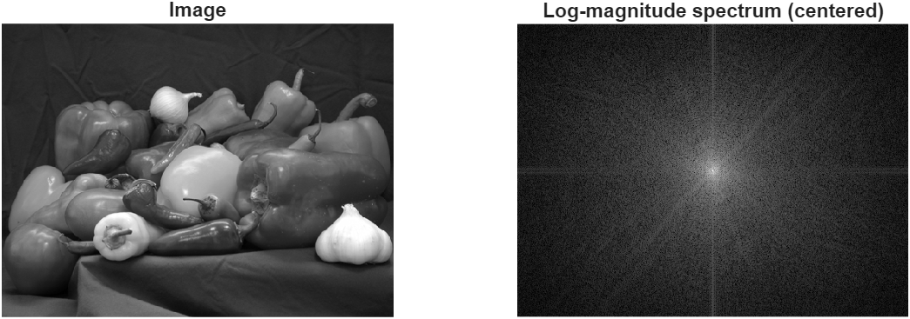
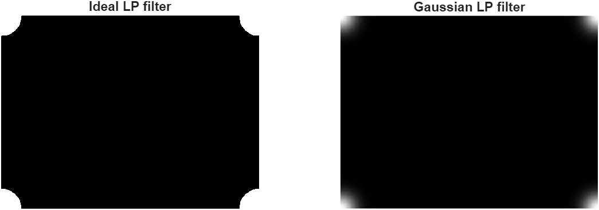
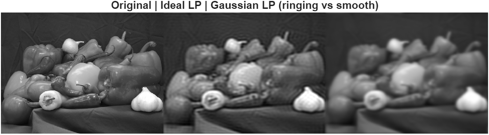
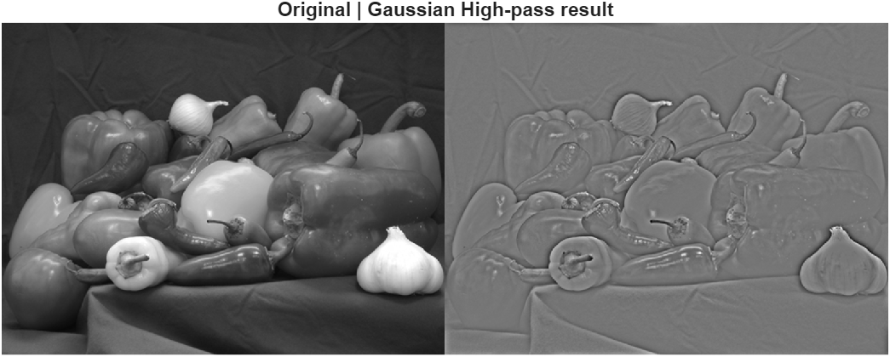
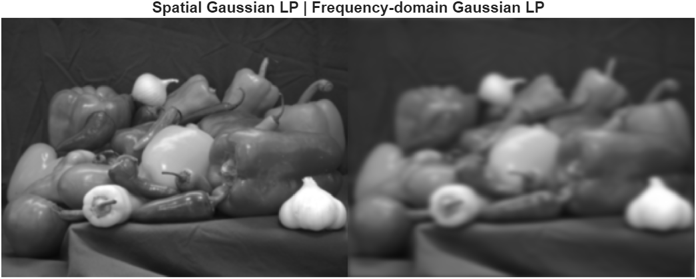

# Lab 3 – Frequency-Domain Filtering with FFT2

This lab introduces **frequency-domain image filtering** using the 2D Fast Fourier Transform (`fft2`).  
We visualize spectra, apply ideal and Gaussian filters, and compare spatial vs frequency approaches.

---

## 1️⃣ Magnitude Spectrum (Log Scale)
We compute the 2D FFT of the image and visualize its centered magnitude spectrum using `fftshift`.  
- Bright center = low frequencies.  
- Dark outer regions = high frequencies.

---

## 2️⃣ Ideal and Gaussian Low-Pass Filters
We design two circular low-pass filters:
- **Ideal LP:** sharp cutoff → strong ringing in spatial domain.  
- **Gaussian LP:** smooth roll-off → fewer artifacts.  
Both filters are visualized as 2D frequency masks.

---

## 3️⃣ Applying LP Filters in Frequency Domain
We multiply each filter with the Fourier transform (`Fshift`) and then invert with `ifft2`.  
- The **Ideal LP** creates ringing near edges (Gibbs phenomenon).  
- The **Gaussian LP** produces smooth blurring.

---

## 4️⃣ High-Pass Filtering (Complement)
The Gaussian high-pass filter is obtained by `1 - H_gauss_LP`.  
It emphasizes **edges and fine details**, removing low-frequency components.

---

## 5️⃣ Spatial vs Frequency-Domain Gaussian Filtering
We compare the Gaussian blur applied:
- In spatial domain (using `imfilter` + `fspecial`).  
- In frequency domain (multiplication in FFT space).  

They match very closely, validating the **convolution theorem**.

---

## 6️⃣ Reflections
1. **Ringing:** The Ideal LP causes ringing because of the abrupt cutoff (Gibbs phenomenon).  
2. **`fftshift`:** Re-centers the zero frequency for easier visualization.  
3. **Efficiency:** Frequency-domain filtering is more efficient for **large kernels** due to FFT computation.

